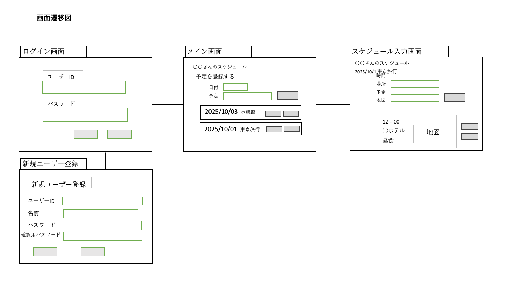

# スケジュール管理アプリ【個人のタスク効率化】

Java/JSPを使って、ログイン機能とタスクのCRUD操作（作成・読み込み・削除）を学習するために制作したアプリケーションです。

---

## ⭐️ アプリの機能と現在の状況

### 🚀目的

個人の予定をアカウントごとに管理し、一日のスケジュールを効率的に可視化・計画するためのアプリケーション。ユーザーが漏れなく、計画的に行動できるように支援します。


### ✍️機能

こちらは機能はほぼ完成してますが一部途中段階の段階のポートフォリオです。
アカウントごとに日付タイトルの一覧を作り、予定の詳細(時間,場所,地図)を１日のスケジュールを組むことができるアプリです。
1日の中で時間ごとのスケジュールを組み立て、効率的な予定管理が可能です。

| 機能 | 状況 | 詳細 |
| :--- | :--- | :--- |
| **ログイン機能** | **完了** | MySQLのusers テーブルと連携したユーザー認証ロジックを実装済みです。パスワードのハッシュ化も対応済み。 |
| **新規登録** | **完了** | MySQLのusers テーブルと連携したユーザー登録ロジックを実装済みです。ユーザーIDの重複を防ぐようにしています。 |
| **予定、予定詳細追加** | **完了** |予定タイトル、日付、詳細（時間・場所・地図）をDBに格納するロジックを実装。 |
| **予定、予定詳細一覧** | **完了** | データ取得・表示ロジックは実装です。 |
| **予定詳細更新/削除** | **実装中** | データベースの更新/削除ロジックは実装です。 |
| **タスク完了** | **未着手** | データベースの更新ロジックは未実装です。 |

＊三層構造：DAO (DB)、Service (ビジネスロジック)、Servlet (制御)、JSP (画面) の役割分担で作成しています。

### 📷 設計スクリーンショット





### 🚶 今後の展望

1. **正しい画面遷移と処理の完成**：
   * 予定の追加や削除の**Servlet処理**を修正し、DBへの情報格納処理を完全に動作させます。
2. **機能の追加（より便利なものに）**：
   * ユーザー,予定,予定の詳細の**編集**機能を実装します。
   * 予定の詳細のタスク**完了**機能実装します。
   * ユーザーの登録**確認**画面への遷移。   
3. **フレームワークへの移行（実務志向）**：
   * 次のステップとして、**Spring Bootフレームワーク**での実装を目指します。実務で求められる**保守性・拡張性の高い開発**を早期に実現するため、学習を継続します。 
---

## ⭐️ 技術スタック

* **言語**: Java (2025)
* **Webフレームワーク**: Servlet / JSP
* **サーバーサイド**: Java / Servlet / JSP
* **フロントエンド(UI)**: HTML / CSS / JavaScript / JSP
* **データベース**: MySQL
* **Webサーバー**: Apache Tomcat
* **開発環境**: Eclipse (macOS / Intel Core i5)

---

## ⭐️ 動作確認手順

###  データベース設定

MySQLで以下のSQLを実行し、データベースとテーブルを作成してください。

```sql
-- データベース作成
CREATE DATABASE schedule_app_db;
-- usersテーブル作成
CREATE TABLE schedule_app_db.users (
user_id INT PRIMARY KEY AUTO_INCREMENT,
user_login VARCHAR(50) UNIQUE NOT NULL,
user_name VARCHAR(255) UNIQUE NOT NULL,
password VARCHAR(256) NOT NULL
)ENGINE=InnoDB DEFAULT CHARSET=utf8mb4;

-- scheduleテーブル作成
CREATE TABLE schedule_app_db.schedule (
schedule_id INT PRIMARY KEY AUTO_INCREMENT,
user_id INT NOT NULL,
title VARCHAR(255) NOT NULL,
date DATE NOT NULL,
FOREIGN KEY (user_id) REFERENCES users(user_id)
);

-- schedule_detailテーブル作成
CREATE TABLE schedule_app_db.schedule_detail (
detail_id INT PRIMARY KEY AUTO_INCREMENT,
schedule_id INT NOT NULL,
time TIME NOT NULL,
place VARCHAR(255) NOT NULL,
detail VARCHAR(1000) NOT NULL,
map VARCHAR(1000) NOT NULL,  
FOREIGN KEY (schedule_id) REFERENCES schedule(schedule_id)
);
